# 🚀 AssistiaAI — Akıllı Kişisel ve Topluluk Asistanı

 
 
 


AssistiaAI, bireylerin ve toplulukların günlük iş akışlarını, takvimlerini, görevlerini ve rezervasyonlarını **yapay zeka desteğiyle** tek bir merkezden yönetmelerini sağlayan, premium tasarıma sahip yeni nesil bir dijital asistan platformudur. 

---

## 📌 İçindekiler
1. [Proje Özeti ve Kapsamı](#1-proje-özeti-ve-kapsamı)
2. [Teknik Mimari ve Teknoloji Yığını](#2-teknik-mimari-ve-teknoloji-yığını)
3. [📱 Uygulama Akışı ve Görsel Keşif (Ekran Görüntüleri)](#3-uygulama-akışı-ve-görsel-keşif-ekran-görüntüleri)
4. [Kurulum ve Çalıştırma Talimatları](#4-kurulum-ve-çalıştırma-talimatları)
5. [API Dokümantasyonu](#5-api-dokümantasyonu)
6. [Güvenlik ve Standartlar](#6-güvenlik-ve-standartlar)
7. [Loglama ve Hata Yönetimi](#7-loglama-ve-hata-yönetimi)

---

## 1. Proje Özeti ve Kapsamı

> **🎯 Projenin Amacı:** Karmaşık günlük programları, seyahat rezervasyonlarını ve grup içi iş birliklerini sıfır eforla organize etmek. Yapay zeka entegrasyonu sayesinde biletlerinizi otomatik okur, sesli/yazılı komutlarınızdan görevler çıkarır ve topluluğunuzla mükemmel bir senkronizasyon sağlar.

*   **👥 Hedef Kitle:** Yoğun iş/okul temposuna sahip bireyler, ortak takvim ve görev takibine ihtiyaç duyan ekipler, aileler, kulüpler veya arkadaş grupları.
*   **✨ Öne Çıkan Özellikler:**
    *   **🧠 Assistia AI Asistan Chatbot:** Doğal dildeki konuşmalarınızdan ("Salı günü akşam 8'e toplantı oluştur") otomatik görev parametreleri ayıklar ve planlama yapar.
    *   **📸 Yapay Zeka Destekli Rezervasyon Girişi (AI OCR):** Uçuş, otel veya otobüs biletlerinizin PDF/görsellerini analiz ederek tüm alanları otomatik doldurur.
    *   **🕒 Akıllı Takvim & Günlük Program:** Zaman tüneli (Timeline) arayüzü ile günlük programınızı saat saat görselleştirir.
    *   **📍 Konum ve Harita Entegrasyonu:** Görev ve rezervasyonlarınıza harita üzerinden nokta atışı konum ekleme desteği sunar.
    *   **🛡️ Güvenli Topluluklar:** Farklı kategorilerde (iş, spor, aile) gruplar oluşturma, üye davet etme ve ortak görev atama.
    *   **⚡ Canlı Veri (SSE):** Server-Sent Events ile arka plan güncellemelerini anında ekrana yansıtan kesintisiz veri akışı.

---

## 2. Teknik Mimari ve Teknoloji Yığını

### Kullanılan Teknolojiler
*   **Mobil İstemci (Frontend):** Flutter (Dart) & **Riverpod** (Modern State Management)
*   **Uygulama Sunucusu (Backend):** FastAPI (Python 3.10+) & **Uvicorn**
*   **Veritabanı Katmanı:** MongoDB (Beanie ODM & Motor Asenkron Sürücü)
*   **Önbellek & Canlı Mesajlaşma (Pub/Sub):** Redis
*   **Kimlik Doğrulama & Bildirim:** Firebase Auth (OAuth 2.0 Google Sign-In) & Firebase Cloud Messaging (FCM)
*   **E-posta Servisi:** Resend (Şifre sıfırlama ve 6 haneli OTP e-posta doğrulama kodları için)
*   **Loglama & Gözlemlenebilirlik (Observability):** Vector (Log Collector), Apache Kafka (Message Broker), ClickHouse (Columnar DB), Grafana (Dashboard Visualizer)

### Sistem Mimarisi ve İstek Akışı

Uygulamanın genel veri ve istek akışı şu şekildedir:

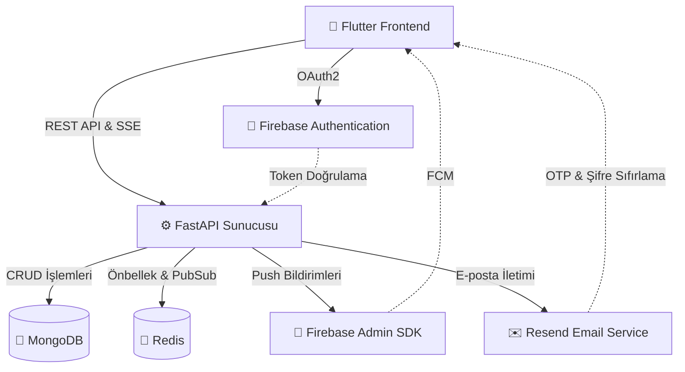

### Dağıtık Loglama ve İzleme Altyapısı

Sistemde oluşan tüm uygulama logları, sistem hataları ve metrikler gerçek zamanlı olarak ClickHouse üzerinde depolanır ve Grafana ile izlenir:

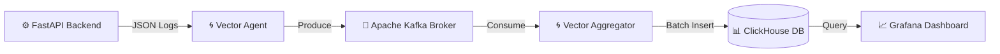

---

## 3. 📱 Uygulama Akışı ve Görsel Keşif (Ekran Görüntüleri)

Uygulamanın kullanım senaryolarını, yapay zeka özelliklerini ve ekran geçişlerini adım adım aşağıdan inceleyebilirsiniz. 

> [!TIP]
> *Tüm ekran görüntüleri projenin kök dizinindeki `assets/screenshots/` klasöründe yer almaktadır.*

### 🔐 Adım 1: Giriş, Kayıt ve Hesap Güvenliği
Uygulamaya dahil olma ve güvenli hesap yönetimi akışıdır. Klasik e-posta/şifre girişine ek olarak Firebase altyapılı hızlı Google Girişi desteklenir. Hesap güvenliği için e-posta güncellemeleri 6 haneli OTP kodu ile doğrulanır.

| 01. Giriş Ekranı (Login) | 02. Hesap Oluşturma (Register) |
| :---: | :---: |
| 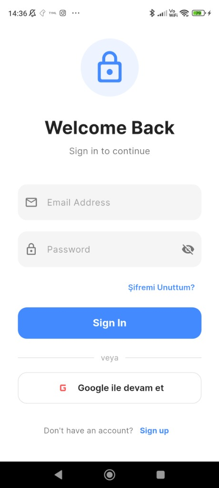 | 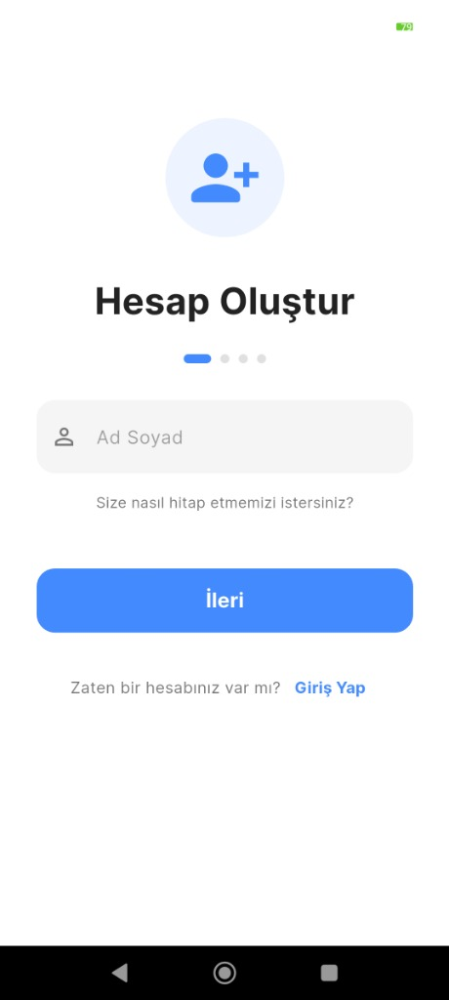 |
| *Modern "Welcome Back" arayüzü ve OAuth entegrasyonu.* | *Stepper tarzında sade ve kullanıcı dostu kayıt adımları.* |

| 03. E-posta Değiştirme (OTP Verification) |
| :---: |
| 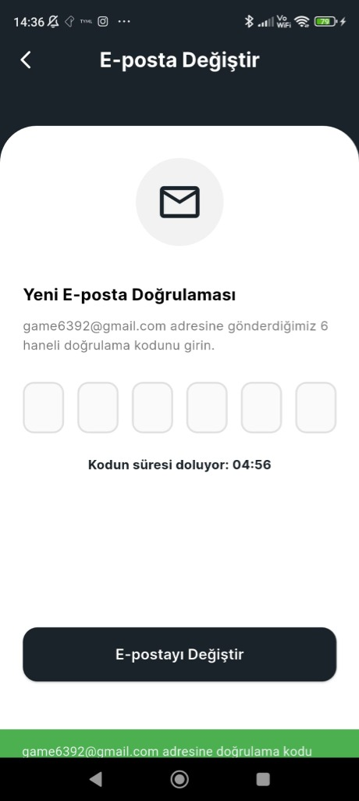 |
| *Güvenli e-posta değişikliği için 5 dakikalık geri sayım sunan OTP ekranı.* |

---

### 🗺️ Adım 2: Akıllı Keşfet (Dashboard) ve Canlı Durum Takibi
Uygulama açıldığında kullanıcının karşılaştığı ana kontrol panelidir. O güne ait tüm görevlerin tamamlanma durumlarını gösteren dinamik bir "Günün Özeti" paneli ve yaklaşan rezervasyon kartları yer alır. SSE sayesinde arka plandaki tüm güncellemeler canlı olarak buraya yansır.

| 04. Keşfet Ekranı (Dashboard) |
| :---: |
| 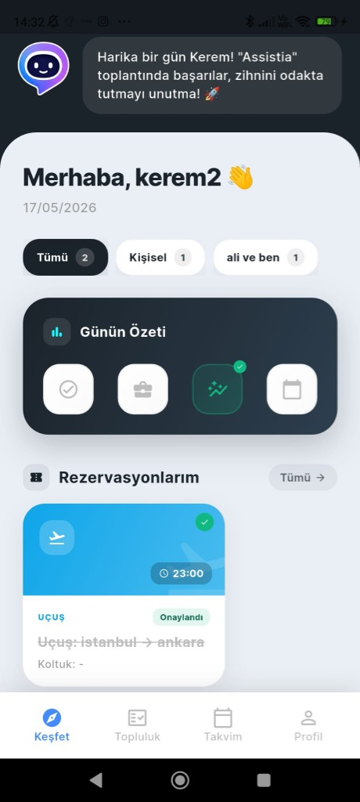 |
| *Canlı durum kartları, Günün Özeti widget'ı ve onaylı rezervasyon listesi.* |

---

### 🧠 Adım 3: Yapay Zeka Asistanı ve Otomatik Görev Yönetimi
Assistia AI Asistan sohbet ekranı üzerinden doğal dilinizle konuşarak planlama yapabilirsiniz. Asistan yazdığınız mesajı arka planda anlamlandırarak takviminize otomatik olarak ilgili görevi ekler. Oluşturulan görevin detayları şık bir bottom sheet ile kontrol edilebilir.

| 05. AI Asistan Sohbet (Chat) | 07. Görev Detay Paneli (Task Bottom Sheet) |
| :---: | :---: |
| 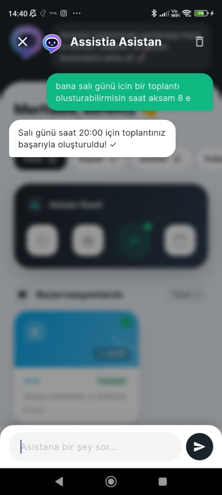 | 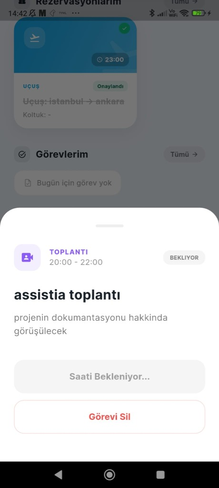 |
| *Doğal dilde verilen komutla ("salı akşamı 8'e toplantı oluştur") otomatik planlama.* | *Oluşturulan göreve tıklanarak açılan, durum ve silme butonları içeren panel.* |

---

### 📅 Adım 4: Akıllı Takvim ve Günlük Program
Takvim sekmesi, kullanıcının zamanını en verimli şekilde planlamasını sağlar. Gün bazlı zaman çizelgesi (Timeline) arayüzü sayesinde görevlerin başlangıç ve bitiş saatleri, kategorilerine göre (Toplantı, Uçuş vb.) özel renk geçişleriyle dikey çizgiler halinde listelenir.

| 06. Akıllı Takvim & Zaman Çizelgesi |
| :---: |
| 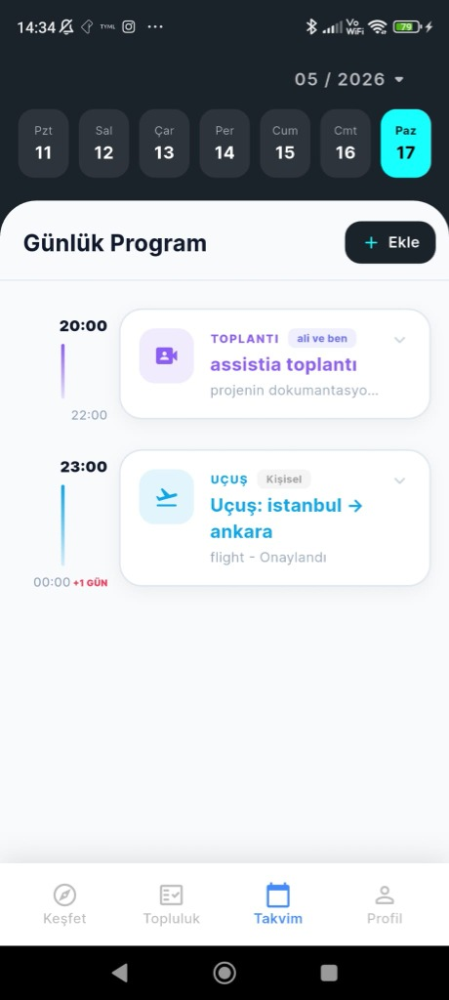 |
| *Zaman blokları şeklinde görselleştirilmiş saatlik günlük program.* |

---

### ✈️ Adım 5: Gelişmiş Rezervasyon Türleri ve AI OCR Girişi
Kullanıcılar manuel giriş yapmak yerine, rezervasyon kartlarını saniyeler içinde oluşturabilirler. Yapay Zeka destekli bilet okuma (AI OCR) özelliği sayesinde, biletin PDF'ini veya fotoğrafını yükleyerek kalkış, varış, saatler, havayolu, PNR gibi tüm alanları otomatik olarak doldurabilirler.

| 08. Rezervasyon Türü Seçimi | 09. AI OCR Destekli Uçuş Girişi |
| :---: | :---: |
| 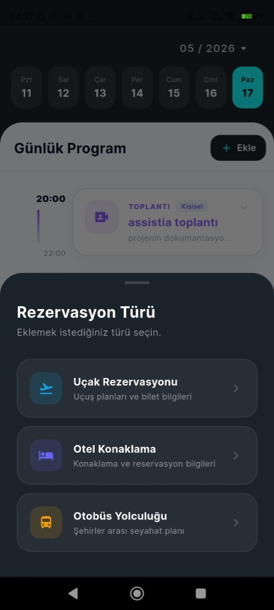 | 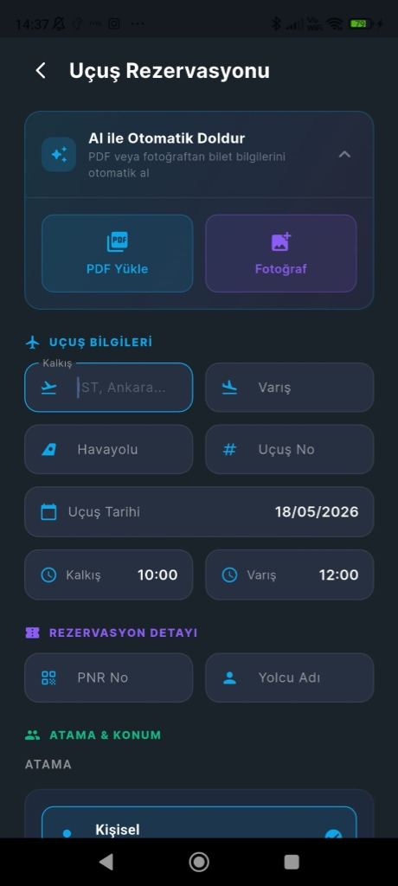 |
| *Uçak, Otel veya Otobüs rezervasyon kategorilerinin seçildiği panel.* | *Bilet görseli veya PDF'inden otomatik veri okuyan akıllı form yapısı.* |

---

### 📍 Adım 6: Harita ve Konum İşaretleme Özelliği
Uygulamadaki görevlere ve rezervasyonlara konum eklemek, buluşma noktalarını belirlemek veya seyahat rotalarını çizmek için entegre harita işaretleme arayüzü kullanılır.

| 12. Harita Konum Seçici (Map Picker) | 13. Rezervasyonda Konum Gösterimi (Map Detail) |
| :---: | :---: |
| 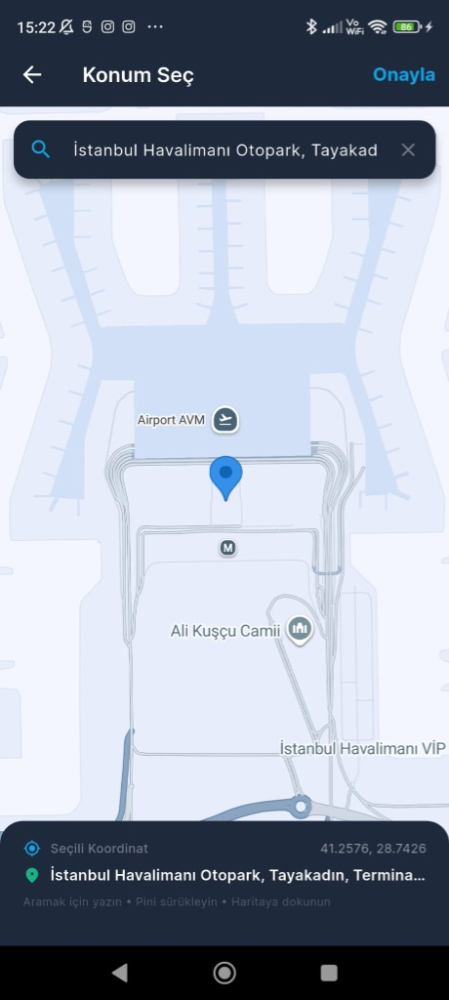 | 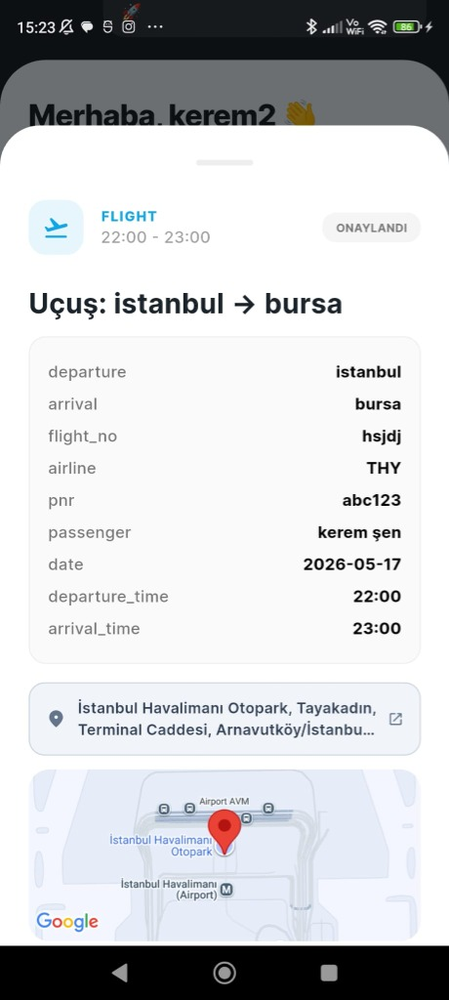 |
| *Google Maps entegrasyonu ile hassas arama, pin sürükleme ve konum işaretleme arayüzü.* | *Rezervasyon detay kartında dinamik harita üzerinde konum gösterimi.* |

---

### 👥 Adım 7: Topluluklar ve Profil Ayarları
Kullanıcılar diğer insanlarla ortak alanlar oluşturup topluluklar kurabilir. "Topluluklarım" ekranından tüm gruplar yönetilir. "Profil" ekranı ise kullanıcı avatarı (MinIO bulut depolama entegreli), bildirim anahtarları (FCM) ve hesap ayarlarını barındırır.

| 10. Topluluklarım (Communities) | 11. Profil & Hesap Ayarları |
| :---: | :---: |
| 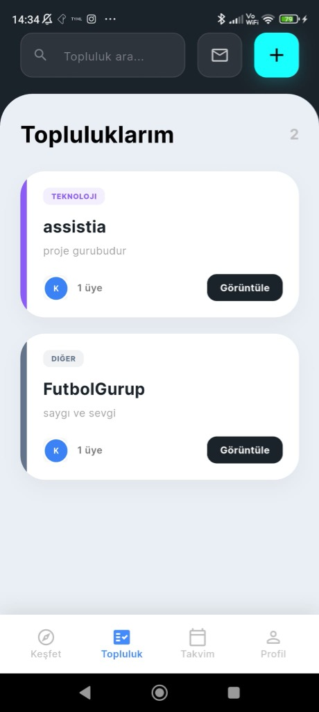 | 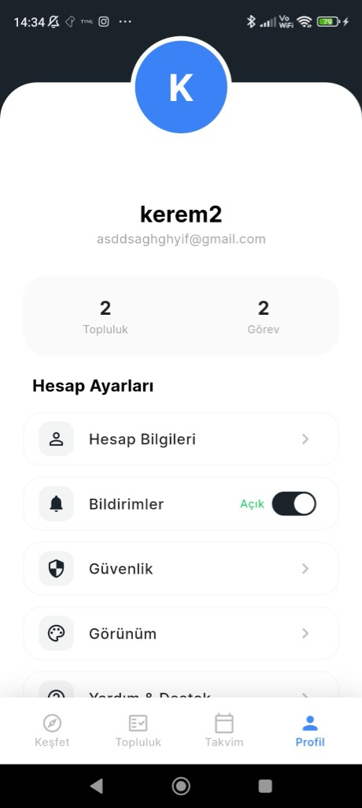 |
| *Üye sayısı ve kategori etiketleri ile listelenen ortak gruplar.* | *Güvenlik, görünüm, yardım ve MinIO tabanlı profil resmi yönetim alanı.* |

---

## 4. Kurulum ve Çalıştırma Talimatları

Sistemi yerel makinenizde veya emülatörde ayağa kaldırmak için aşağıdaki yönergeleri takip edin.

### Ön Gereksinimler
*   [Docker Desktop](https://www.docker.com/products/docker-desktop/)
*   [Flutter SDK](https://docs.flutter.dev/get-started/install) (Sürüm 3.19.0+ veya en güncel kararlı sürüm)
*   Python 3.10+ (Sadece yerel backend geliştirmesi için gerekebilir)

---

### 🛠️ Adım 1: Backend ( FastAPI, MongoDB, Redis ) Ayağa Kaldırma

Backend servisleri Docker compose ile tamamen izole ve konfigüre edilmiş olarak tek komutla ayağa kalkar:

1. Proje ana dizinindeyken `backend` klasörüne geçin:
   ```bash
   cd backend
   ```
2. `.env.example` dosyasının bir kopyasını oluşturup adını `.env` yapın ve gerekli API anahtarlarını girin:
   ```bash
   cp .env.example .env
   ```
3. Firebase Console'dan elde edeceğiniz `firebase-credentials.json` (Firebase Service Account Anahtarı) dosyasını `backend/` klasörünün içine yerleştirin.
4. Docker container'larını oluşturun ve arka planda çalıştırın:
   ```bash
   docker-compose up --build -d
   ```
   > [!TIP]
   > Bu komut FastAPI sunucusunu `http://localhost:8000` portundan dışarı açar, MongoDB ve Redis servislerini otomatik bağlar.

---

### 📱 Adım 2: Frontend ( Flutter Mobil Uygulama ) Çalıştırma

1. Proje ana dizinindeyken `frontend` klasörüne geçin:
   ```bash
   cd frontend
   ```
2. Flutter bağımlılıklarını indirin:
   ```bash
   flutter pub get
   ```
3. **Firebase İstemci Entegrasyonu:**
   * Android için Firebase'den indirdiğiniz `google-services.json` dosyasını `frontend/android/app/` dizinine yerleştirin.
4. Android emülatörünüz veya fiziksel cihazınız bağlıyken projeyi başlatın:
   ```bash
   flutter run
   ```
   > [!NOTE]
   > Emülatör veya cihazınızın yerel bilgisayarınızda çalışan Docker backend sunucusuna erişebilmesi için `frontend/lib/core/config/env.dart` dosyasındaki API URL değerinin yerel ağ IP'nizle (Örn: `http://192.168.1.X:8000`) veya emülatör IP köprüsüyle (`http://10.0.2.2:8000`) doğru şekilde eşleştiğinden emin olun.

---

## 5. API Dokümantasyonu

FastAPI, sunulan tüm uç noktalar (endpoints) için interaktif ve self-documenting Swagger UI sunmaktadır.

Backend Docker üzerinde çalışırken tarayıcınızdan şu adrese erişebilirsiniz:
👉 **[http://localhost:8000/docs](http://localhost:8000/docs)** (Swagger UI)

*   **Önemli Uç Noktalar:**
    *   `POST /api/v1/auth/login` - Kullanıcı girişi ve JWT üretimi.
    *   `POST /api/v1/tasks` - Yeni görev/toplantı oluşturma.
    *   `POST /api/v1/reservations/ocr` - PDF/Bilet görselinden bilgi okuma (AI OCR).
    *   `GET /api/v1/sse/stream` - SSE Canlı veri akışı bağlantısı.

---

## 6. Güvenlik ve Standartlar

*   **Kimlik Doğrulama & Yetkilendirme:** 
    * Kendi e-posta kayıt sistemimizde oturum yönetimi yüksek güvenlikli **JWT (JSON Web Tokens)** kullanılarak yapılmaktadır.
    * Google ile hızlı girişlerde **OAuth 2.0** akışı Firebase Auth üzerinden sağlanır. İstemciden gelen `idToken` backend tarafında `firebase-admin` kütüphanesiyle kriptografik olarak doğrulanır.
*   **Parola Şifreleme:** Veritabanındaki tüm kullanıcı parolaları **Bcrypt** algoritması kullanılarak tek yönlü şifrelenir (salt/hash).
*   **Veri İletişim Güvenliği:** Backend ve Frontend arasındaki hassas veri transferleri için JSON formatı kullanılır ve JWT token'ları HTTP Authorization header (`Bearer <token>`) ile taşınır.

---

## 7. Loglama ve Hata Yönetimi

*   **Dağıtık Loglama Boru Hattı (Log Pipeline):**
    * **Log Üretimi:** Backend sunucusundaki tüm işlemler standart, yapılandırılmış JSON logları olarak üretilir.
    * **Vector Agent & Aggregator:** Sunucudaki logları en düşük kaynak kullanımı ile toplayıp, merkezi log barındırma katmanına taşıyan yüksek performanslı log taşıma ajanlarıdır.
    * **Apache Kafka Broker:** Yüksek trafik altında oluşabilecek log yoğunluğunu tamponlayan (buffer) ve kayıpsız iletim sağlayan dağıtık veri akış platformu.
    * **ClickHouse OLAP Veritabanı:** Logların analiz edilmesi ve saklanması için optimize edilmiş, sütun bazlı (column-oriented) yüksek performanslı analitik veritabanı.
    * **Grafana Paneli (Observability UI):** ClickHouse üzerinde biriken log verilerini gerçek zamanlı sorgulayarak hata oranları, API yanıt süreleri (latency) ve sistem sağlığını görsel grafiklerle canlı olarak takip etmemizi sağlayan izleme arayüzü.
*   **Merkezi Hata Yakalama:** FastAPI sunucusunda beklenmedik tüm hatalar global exception handler'lar yardımıyla yakalanarak frontend'e anlamlı JSON hata şablonları (`{"detail": "Hata mesajı"}`) halinde gönderilir.
*   **Anlık Slack Alarm Entegrasyonu (Slack Real-Time Alerting):**
    * Sistemde oluşan **kritik hatalar (CRITICAL/ERROR seviyesi) ve büyük exception'lar**, backend tarafındaki özel hata dinleyici (log handlers) mekanizması ve Slack Webhook API entegrasyonu yardımıyla anında ekibin **Slack kanalına** otomatik bildirim olarak iletilir.
    * Bu sayede sunucu tarafındaki kritik veri tabanı bağlantı sorunları, beklenmedik çökmeler veya yüksek öncelikli hata durumları anında izlenebilir hale getirilerek operasyonel kesinti süreleri minimuma indirilir.
*   **Grafana ile Gözlemlenebilirlik (Grafana Observability UI):**
    * ClickHouse veritabanındaki logları ve API performans metriklerini görselleştirdiğimiz, sistem durumunu canlı olarak izleyebildiğimiz panellerimiz:

    | 13. Grafana Performans ve Metrik Paneli | 14. Grafana Hata ve Detaylı Log Arayüzü |
    | :---: | :---: |
    | 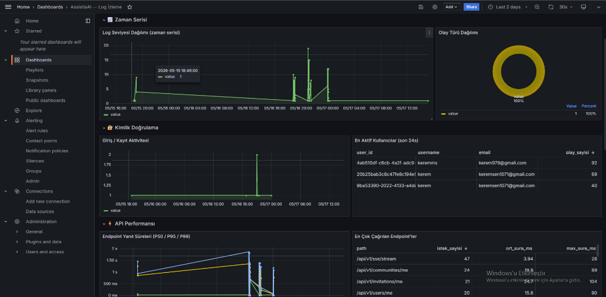 | 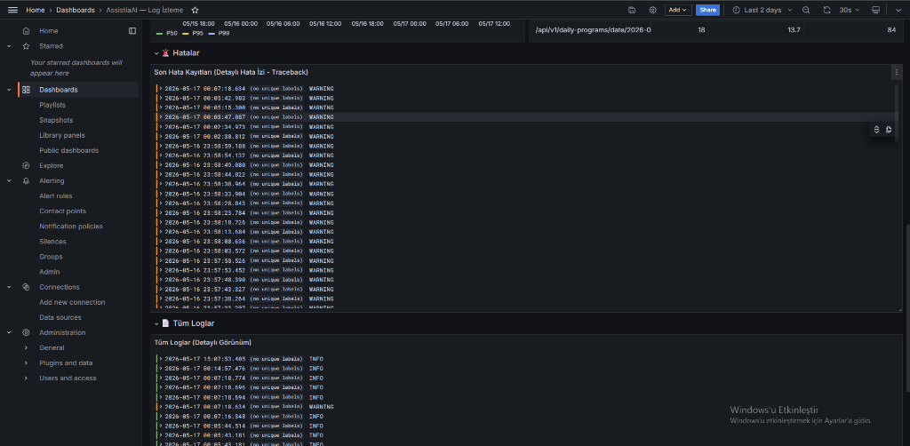 |
    | *Zaman serisi log dağılımı, aktif kullanıcılar (son 24 saat), en çok çağrılan endpoint'ler ve API yanıt süreleri (P50/P95/P99).* | *Hataların ayrıntılı izlerini (traceback) içeren son hata kayıtları ve detaylı filtrelemeye uygun tüm loglar görünümü.* |

*   **Log Takibi:** Docker üzerindeki FastAPI loglarını canlı izlemek için:
   ```bash
   docker logs assistia-backend -f
   ```
*   **Riverpod Hata Yönetimi:** Frontend tarafında, asenkron veri çeken tüm sağlayıcılar (Providers) `AsyncValue` yapısıyla sarmalanmıştır. İnternet kesintileri, sunucu çökmeleri veya yetki hataları anında yakalanarak kullanıcıya estetik SnackBar'lar veya hata sayfaları eşşliğinde sunulur.

---
↳ *AssistiaAI ekibi tarafından sevgiyle ve yapay zekayla geliştirildi.* ❤️
