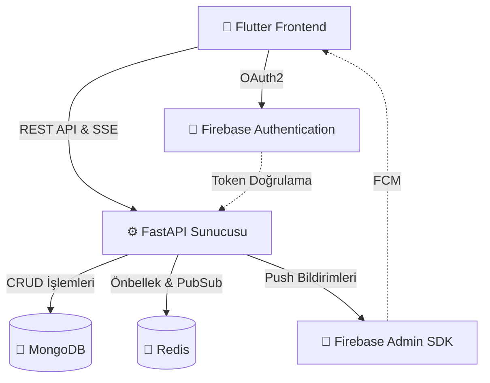

# AssistiaAI 

   

---

## 1. Proje Özeti ve Kapsamı

> **Projenin Amacı:** AssistiaAI, bireylerin ve toplulukların günlük iş akışlarını yapay zeka desteğiyle tek bir merkezden yönetmelerini sağlayan kapsamlı bir dijital asistan platformudur. Karmaşık programları, görevleri ve grup etkileşimlerini basitleştirmeyi hedefler.

*   **Hedef Kitle:** Günlük hayatını daha organize hale getirmek isteyen bireyler, ortak takvim ve görev yönetimine ihtiyaç duyan ekipler, aileler veya öğrenci grupları.
*   **Temel Özellikler:**
    *   **Görev Yönetimi (Task Management):** Kişisel ve gruba atanmış görevlerin takibi.
    *   **Rezervasyonlar:** Uçuş, otobüs, otel gibi rezervasyonların merkezi olarak tutulması.
    *   **Günlük Programlar (Daily Programs):** Yapay zeka ile desteklenmiş günlük planlamalar.
    *   **Topluluk/Grup Etkileşimi:** Gruplar (Communities) kurabilme, gruba özel görev atama ve davet gönderme.
    *   **Gerçek Zamanlı Bildirimler:** Anlık güncellemeler (SSE) ve Push Bildirimleri (FCM).

---

## 2. Teknik Mimari ve Teknoloji Yığını

### Kullanılan Teknolojiler
*   **Frontend:** Flutter (Dart), Riverpod (State Management)
*   **Backend:** FastAPI (Python 3.10+)
*   **Veritabanı:** MongoDB (Beanie ODM & Motor)
*   **Önbellek & Pub/Sub:** Redis
*   **Kimlik Doğrulama & Bildirimler:** Firebase Auth, Firebase Cloud Messaging (FCM)

### Sistem Mimarisi

Aşağıdaki diyagram, uygulamanın temel bileşenleri arasındaki veri akışını göstermektedir:



### Veritabanı Şeması (Özet)
Projede NoSQL tabanlı MongoDB kullanılmaktadır. Temel koleksiyonlar şunlardır:
*   **Users:** Kullanıcı profilleri, şifrelenmiş parolalar ve OAuth verileri.
*   **Communities:** Grup isimleri, açıklamaları, yöneticiler ve üyeler.
*   **Tasks & Reservations:** Hem bireysel hem de topluluklara bağlı görev ve rezervasyon belgeleri.
*   **Invitations:** Topluluk davet kodları ve durumları.

---

## 3. Kurulum ve Çalıştırma Talimatları

Projeyi sisteminizde ayağa kaldırmak için aşağıdaki adımları izleyin.

### Gereksinimler
*   [Docker Desktop](https://www.docker.com/products/docker-desktop/)
*   [Flutter SDK](https://docs.flutter.dev/get-started/install) (Sürüm 3.8.1+)
*   Python 3.10+ (Sadece backend geliştirmesi yapılacaksa)

### Adım 1: Backend (Sunucu) Kurulumu

Backend tarafında tüm ortam Docker üzerinden izole olarak ayağa kalkar.

1. Terminali açın ve `backend` klasörüne gidin:
```bash
cd backend
```
2. **Çevre Değişkenleri:** `.env.example` dosyasını kopyalayarak `.env` oluşturun ve gizli anahtarlarınızı doldurun.
```bash
cp .env.example .env
```
3. **Firebase Yetkilendirmesi:** Firebase Console'dan indireceğiniz `firebase-credentials.json` (Service Account) dosyasını `backend` dizininin içine ekleyin.
4. Docker ile servisleri başlatın:
```bash
docker-compose up -d --build
```
> [!TIP]
> Bu komut FastAPI, MongoDB ve Redis'i birlikte başlatır. Backend artık `http://10.0.0.2:8000` adresinde(android emulator) çalışmaktadır.

### Adım 2: Frontend (Mobil) Kurulumu

1. Terminalden `frontend` klasörüne geçin:
```bash
cd frontend
```
2. Bağımlılıkları yükleyin:
```bash
flutter pub get
```
3. **Firebase İstemci Ayarları:** Eğer kendi Firebase projenizi kullanıyorsanız:
   * Android için `google-services.json` dosyasını `frontend/android/app/` dizinine,
4. Uygulamayı başlatın:
```bash
flutter run
```

---

## 4. API Dokümantasyonu

FastAPI, projenin tüm API uç noktaları için otomatik ve etkileşimli bir dokümantasyon sağlar.

Backend Docker üzerinden çalışırken tarayıcınızda şu adrese gidin:
👉 **[http://localhost:8000/docs](http://localhost:8000/docs)** (Swagger UI)

*   **Örnek Uç Nokta:** `POST /api/v1/auth/login`
*   **Request Body:** `{"email": "user@example.com", "password": "mypassword"}`
*   **Response (200 OK):** `{"access_token": "eyJhbGciOi...", "token_type": "bearer"}`

Alternatif (ReDoc) dokümantasyonu için: `http://localhost:8000/redoc` adresini kullanabilirsiniz.

---

## 5. Güvenlik ve Standartlar

> [!IMPORTANT]
> Kullanıcı verilerinin güvenliği en yüksek standartlarda sağlanmaktadır.

*   **Kimlik Doğrulama:** 
    * Kendi e-posta kayıt sistemimizde oturum yönetimi **JWT (JSON Web Tokens)** kullanılarak yapılmaktadır.
    * Google ile girişlerde **OAuth 2.0** akışı Firebase Auth üzerinden sağlanır ve `idToken` Backend'de `firebase-admin` ile doğrulanır.
*   **Şifreleme:** Veritabanındaki tüm kullanıcı parolaları **Bcrypt** algoritması ile geri döndürülemez şekilde (hash/salt) şifrelenir.
*   **Kod Standartları:**
    *   **Python:** PEP-8 standartlarına uyulur.
    *   **Flutter:** `flutter_lints` paketi kullanılarak sıkı statik kod analizi kuralları işletilmektedir.

---

## 6. Test ve Hata Yönetimi

*   **Loglama:** FastAPI tarafında tüm hatalar ve istekler standart log mekanizması ile konsola yazdırılır. Docker üzerinden logları izlemek için: `docker logs assistia-backend -f` komutu kullanılır.
*   **Hata Yönetimi (Error Handling):** Backend'de özel Exception Handler'lar (Örn: HTTP 404, 409 Conflict) mevcuttur. Frontend tarafında Riverpod sayesinde hatalar UI bileşenlerine SnackBar veya özel hata ekranları olarak yansıtılır.
*   **Testler:** *(Gelecekte eklenecek)* 
    * Frontend birim testleri için: `flutter test`
    * Backend testleri `pytest` ile çalıştırılacaktır.

---